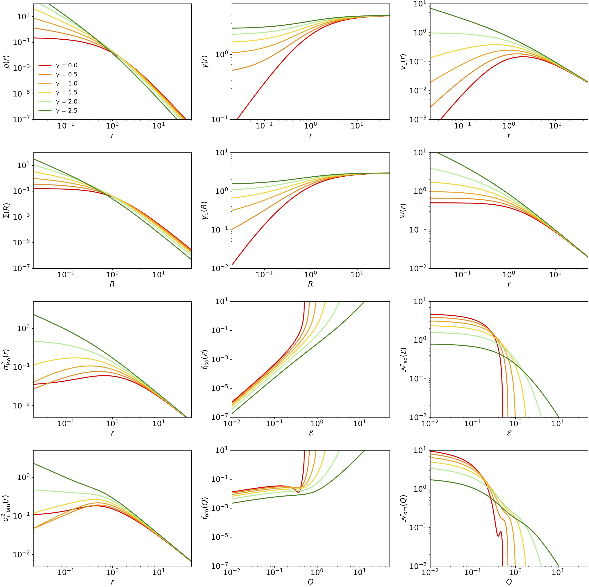

# SpheCow
Flexible dynamical models for galaxies and dark matter haloes 

## General description

SpheCow is a light-weight and flexible code that allows to easily explore the structure and dynamics of any spherical model for galaxies and dark matter haloes. The code can automatically calculate the dynamical properties, assuming an isotropic or Osipkov-Merritt anisotropic orbital structure, of any model with either an analytical density profile or an analytical surface density profile as starting point. SpheCow contains readily usable implementations for many standard models, including the Plummer, Hernquist, NFW, Einasto, Sérsic and Nuker models. The code is publicly available as a set of C++ routines and as a Python module, and is designed to be easily extendable, in the sense that new models can be added in a straightforward way. 

SpheCow has been developed by Maarten Baes, Peter Camps and Bert Vandenbroucke at the Sterrenkundig Observatorium, Universiteit Gent. It is available for use under the terms of the AGPL license (see the file LICENSE.txt in
this repository).

For a more complete description of SpheCow, we refer to the paper

SpheCow: flexible dynamical models for galaxies and dark matter haloes
Baes, Camps & Vandenbroucke (2021), A&A, in press (arXiv:2105.11948)
https://ui.adsabs.harvard.edu/abs/2021arXiv210511948B

## Installation

SpheCow consists of a set of C++ source files and header files and two data input files, all within a single directory. The directory also contains a simple Makefile. 

To install the code, simply copy all of these files to a directory, for example SpheCow, open a terminal, move to the SpheCow directory, and type 
````
SpheCow$ make
````
If everything goes well, this should give the following output:
````
g++ -Wall -std=c++14   -c -o BPLModel.o BPLModel.cpp
g++ -Wall -std=c++14   -c -o DeVaucouleursModel.o DeVaucouleursModel.cpp
g++ -Wall -std=c++14   -c -o DensityModel.o DensityModel.cpp
...
g++ -o SpheCow BPLModel.o DeVaucouleursModel.o DensityModel.o EinastoModel.o GammaModel.o GaussLegendre.o HernquistModel.o HypervirialModel.o IsochroneModel.o JaffeModel.o Model.o NFWModel.o NukerModel.o PlummerModel.o PerfectSphereModel.o SersicModel.o SigmoidDensityModel.o SigmoidSurfaceDensityModel.o SpheCow.o SurfaceDensityModel.o ZhaoModel.o 
````
and an executable file SpheCow should be present in the same directory. The default main function (in the SpheCow.cpp file) just creates a Plummer model and runs the routine calculate_energy_model,
````
int main(void)
{
    GaussLegendre gl(128);
    double Mtot = 3.0;
    double b = 7.0;
    PlummerModel model(Mtot, b, &gl);
    double ra = 6.2;
    calculate_energy_model(&model, ra);
    return 0;
}
````
Running SpheCow, i.e. typing
````
SpheCow$ ./SpheCow
````
should result in the following output:
````
Properties independent of the orbital structure
total mass = 3
total potential energy = -0.378674114495

Properties for an isotropic orbital structure
total mass = 3
total kinetic energy = 0.189337057248
total integrated binding energy = 0.568011171743

Properties for an Osipkov-Merritt orbital structure with ra = 6.2
total mass = 3.00000000152
total kinetic energy = 0.189337057248
````
If you see this on your terminal window, everything is fine, and you are ready to go.

## Using SpheCow

The workhorse routine for SpheCow is the routine run_model that is implemented in SpheCow.cpp. It calculates the most important photometric and dynamical properties for a given model, both for an isotropic orbital structure and an Osipkov-Merritt orbital structure. The routine reads in a vector with radii, calculates the entire set of properties at each of these radii, and writes the results to a file. A typical main function could be the following
````
int main(void)
{
    GaussLegendre gl(128);
    double Mtot = 3.0;
    double b = 1.0;
    PlummerModel model(Mtot, b, &gl);
    double ra = 3.0;
    double logrmin = -2.0;
    double logrmax = 2.0;
    size_t num = 201;
    double dlogr = (logrmax-logrmin)/(num-1.0);
    std::vector<double> rv(num);
    for (size_t i=0; i<num; ++i) rv[i] = pow(10.0,logrmin+i*dlogr);
    std::string filename = "Plummer.dat";
    run_model(&model, ra, filename, rv);
    return 0;
}
````
Running SpheCow with this main function should lead to the following output on the terminal:
````
Calculating properties for r = 0.01
Calculating properties for r = 0.0104713
Calculating properties for r = 0.0109648
…
Calculating properties for r = 95.4993
Calculating properties for r = 100
````
It should create a file Plummer.dat in the current directory that looks like
````
# column 0: radius
# column 1: density
# column 2: density slope
# column 3: mass
...
# column 19: osipkov-merritt pseudo differential energy distribution for ra = 3

1.0000000000000000e-02  7.1601822593148101e-01  4.9995000499950025e-04  2.9995500562434399e-06  2.9995500562434401e-04  9.5473870126385640e-01  3.9996000393972651e-04  2.9997180981519722e-04  2.9998500112490629e+00  4.9997500187488836e-01  4.4176437924425471e-01  9.0269691106355424e-02  5.3701425906329534e-07  4.8476111285351995e-08  5.2775385985285861e-01  5.2774799598623656e-01  4.7243997280631611e-01  8.4628274223211827e-02  5.3701127568544631e-07  4.5446337499664756e-08  
...
1.0000000000000000e+02  7.1601822593148065e-11  4.9995000499950013e+00  2.9995500562434385e+00  2.9995500562434385e-02  9.5473870126323188e-09  3.9996000399960034e+00  2.9997000382029952e+00  2.9998500112490625e-02  4.9997500187484254e-03  4.4176437924451995e-03  9.0269691106639964e-09  7.5930528543651737e+06  6.8542253571993506e-02  7.4976269264066270e-03  6.7417966168108350e-06  1.1086399815864662e-03  4.3965727678924521e-06  4.1284654969291369e+04  1.8151098976982222e-01    
````
This file contains essentially all you want to know about the dynamical models, and is ready to be used in e.g. plotting scripts. It is obviously possible to change the main function to get additional/other output.

## Calling SpheCow from Python

The SpheCow code can also be called directly from Python. The SpheCow distribution contains a Python script setup.py that generates a Python library pySpheCow. In the SpheCow directory, type
````
SpheCow$ python setup.py build --build-lib .
````
This should generate output similar to the following:
````
running build
running build_ext
building 'pySpheCow' extension
creating build
creating build/temp.macosx-10.9-x86_64-3.7
gcc -Wno-unused-result -Wsign-compare -Wunreachable-code -DNDEBUG -g -fwrapv -O3 -Wall -Wstrict-prototypes -I/Users/mbaes/opt/anaconda3/include -arch x86_64 -I/Users/mbaes/opt/anaconda3/include -arch x86_64 -I/Users/mbaes/opt/anaconda3/lib/python3.7/site-packages/numpy/core/include -I/Users/mbaes/opt/anaconda3/include/python3.7m -c NFWModel.cpp -o build/temp.macosx-10.9-x86_64-3.7/NFWModel.o -std=c++14
...
````
It should now have created a library pySpheCow.cpython-37m-darwin.so that can directly be called from Python, by adding the line
````
import pySpheCow
````
in your Python programme or notebook. We have included a Jupyter Notebook example called Gamma.ipynb that demonstrates the use of the pySpheCow library. Typing in the terminal 
````
SpheCow$ jupyter-notebook Gamma.ipynb &
````
the notebook should open in your browser. It should be self-explanatory. This notebook imports the pySpheCow library, sets up a set of 6 gamma-models, runs the run_model() routine for each of these, and plots the results in a PDF file Gamma.pdf. The results should look like this:


